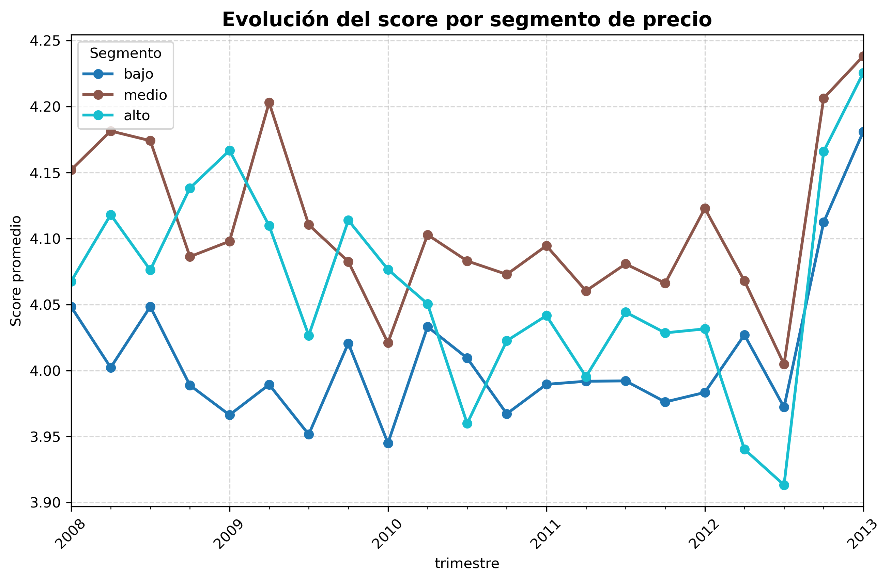
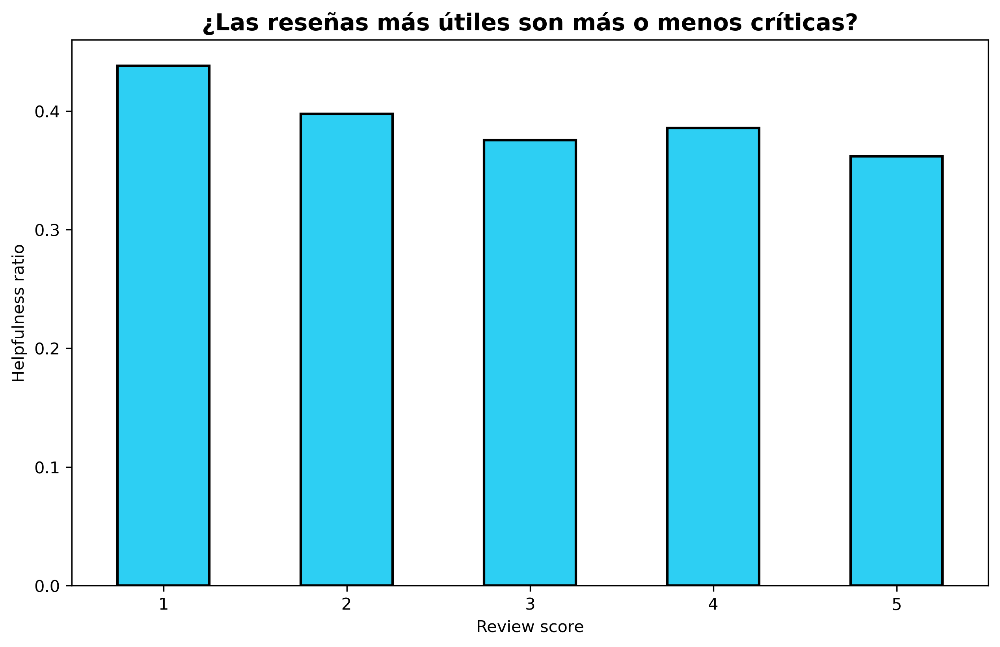
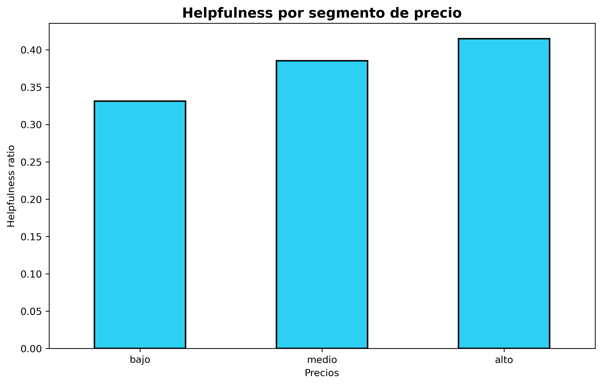
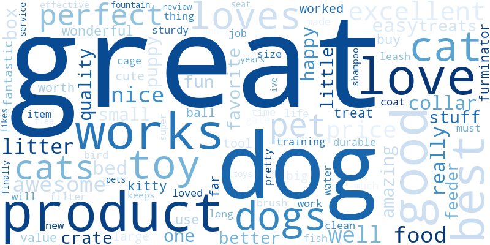
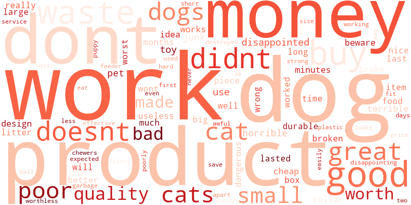

# pet-supplies-reviews-analysis
Análisis exploratorio de datos (EDA) y procesamiento de lenguaje natural aplicado a reseñas de productos para mascotas.

# Análisis de Inteligencia de Clientes: E-commerce de Mascotas 🐾

## Contexto de Negocio
Este proyecto se sitúa en una empresa de *e-commerce* especializada en productos para mascotas. Ante el crecimiento del volumen de ventas, el equipo de Producto identificó la necesidad de explotar las reseñas de los clientes para convertirlas en *insights* accionables.

El objetivo es transformar datos no estructurados (un archivo de texto plano con formato clave-valor) en una base de conocimiento que permita optimizar el catálogo de productos y mejorar la experiencia del usuario.

## Objetivos Estratégicos
* **Ingeniería de Datos:** Desarrollar un *parser* robusto para estructurar y limpiar un dataset de reseñas de e-commerce.
* **Detección de Riesgos:** Identificar productos de alta visibilidad (muchas reseñas) pero baja satisfacción para intervención inmediata del equipo de Producto.
* **Análisis de Tendencias:** Evaluar la evolución temporal de la satisfacción del cliente segmentada por líneas de negocio (rangos de precio).
* **Minería de Texto:** Comparar el lenguaje y patrones de palabras entre clientes satisfechos e insatisfechos.

---

## Flujo de Trabajo (Pipeline)
1. **Extracción y Estructuración:** Parseo de archivos `.txt` nativos a estructuras de datos relacionales.
2. **Preprocesamiento:** Limpieza de strings, normalización de tipos de datos y manejo de valores nulos en precios y ratings.
3. **Análisis Estadístico:** Agrupación de métricas de rendimiento por producto y usuario.
4. **Visualización de Datos:** Generación de reportes gráficos para identificar patrones temporales y lingüísticos.

---

## 🚀 Hallazgos Clave (Insights)
El análisis permitió identificar patrones de consumo y comportamiento que no eran evidentes a simple vista:

* **Valor de la crítica:** Los usuarios consideran más "útiles" las reseñas negativas o críticas que las valoraciones positivas genéricas.
* **Riesgo y Precio:** Existe una mayor tendencia a valorar y consultar reseñas cuando el producto pertenece a un segmento de precio alto, lo que sugiere una búsqueda de seguridad antes de una inversión mayor.
* **Mito del texto largo:** Se comprobó que una reseña más extensa no garantiza ser más útil para otros compradores (correlación muy débil de 0.2).
* **Alertas de Calidad:** Se aislaron productos con más de 50 reseñas pero satisfacción menor a 3 puntos para su revisión comercial.

---

## 📈 Resultados y Visualizaciones

### 1. Evolución de la Satisfacción y Precios
Los productos de precio "intermedio" suelen mantener la mejor valoración promedio a lo largo del tiempo.

### 2. Análisis de Utilidad (Helpfulness)
¿Qué hace que una reseña sea valiosa para la comunidad? Los datos muestran que las críticas constructivas y el precio del producto son factores determinantes.
| Utilidad según Score | Utilidad según Precio |
| :---: | :---: |
|  |  |

### 3. Minería de Texto
Contraste lingüístico entre los usuarios con mejor y peor experiencia de compra.
| Clientes Satisfechos (Score 4-5) | Clientes Insatisfechos (Score 1-2) |
| :---: | :---: |
|  |  |

---

## 📂 Acceso a Datos Crudos
Para mantener la eficiencia del repositorio, el archivo original con las reseñas no está incluido directamente.

* **Archivo de Reseñas (`Pet_Supplies.txt`):** [Descargar desde Google Drive](https://drive.google.com/file/d/1yuNqvx2n23Vxw_Itjuq4BFZoDIBy62KT/view?usp=drive_link)
* **Procesamiento:** Este archivo de texto plano es la entrada principal del pipeline, donde se estructura y transforma en el dataset final utilizado para el análisis.

*(Nota: Para ejecutar el código, descargue el archivo y actualice la ruta de lectura en la primera celda del notebook).*
